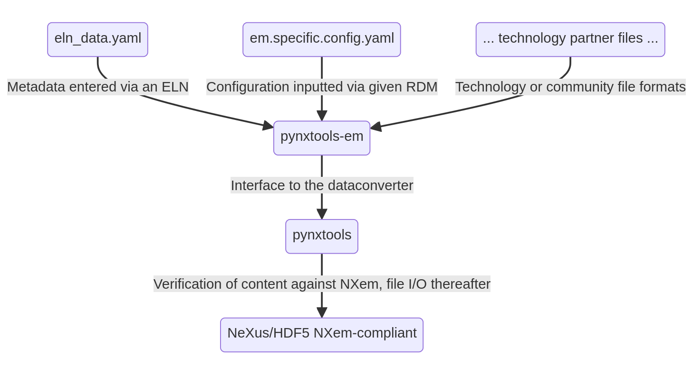

# Learn

Pynxtools-em offers the electron microscopy community a set of diverse examples how a parser can be implemented to provide for a diverse and wide coverage of the (meta)data from the research field of electron microscopy. We would like to encourage the community to share example files with us. These can be small and come from diverse use cases.

## Workflow

The following diagram shows how `pynxtools-em` processes information and interacts with the core routines of `pynxtools`.

