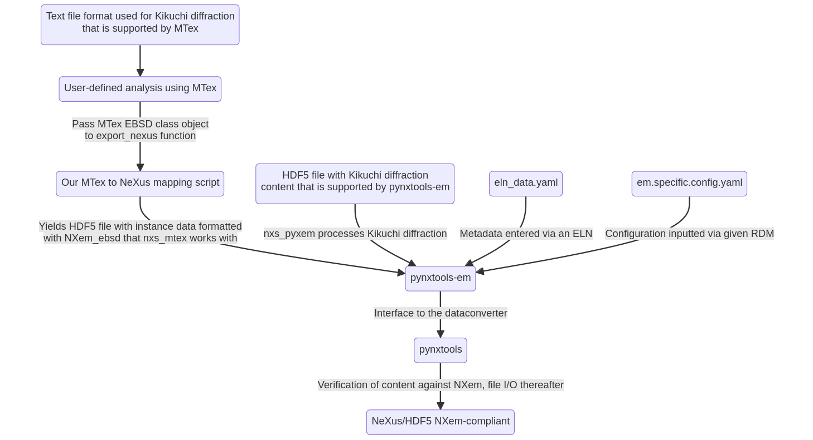

# Kikuchi diffraction

The following diagram shows a comprehensive example how diverse datasets from Kikuchi diffraction can be normalized using different tools from the scientific community and `pynxtools-em` as the glue tool to create a NeXus/HDF5 artifact that can be useful for creating supplementary material in publications<!--or use in the NOMAD Oasis research data management system-->.

[Further details to the parsing route via MTex](mtex.md)
[Further details to the parsing route via pyxem](pyxem.md)
[Further details to the NXem_ebsd base class](https://fairmat-nfdi.github.io/nexus_definitions/classes/contributed_definitions/NXem_ebsd.html#nxem-ebsd)
[Further details to  the NXem application definition](https://fairmat-nfdi.github.io/nexus_definitions/classes/contributed_definitions/NXem.html#nxem)
